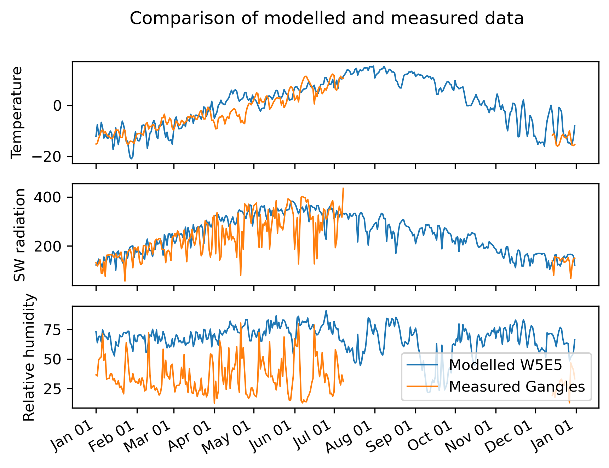

# Quantifying winter water storage using artificial ice reservoirs (AIRs)

## Notebooks
- [test_W5E5_quality.ipynb](docs/test_W5E5_quality.ipynb): 
    - extract temperature data for Leh Glacier (4572 m a.s.l.) from W5E5 and ERA5 (monthly varying lapse rates),
    - extract temperature data from Gangles AWS (4009 m a.s.l.)
    - Apply lapse correction for AWS temperature and compare

- [peak_water.ipynb](docs/peak_water.ipynb): 
    - process different climate data (WFDE5_CRU, ERA5_daily, W5E5, W5E5_MSWEP(prcp from MSWEP, temp. from W5E5)),
    - new mass-balance model `TIModel_Parent` with children `TIModel` and `TIModel_Sfc_Type`

## How to install!

## code inside of MBsandbox

- [mbmod_daily_oneflowline.py](MBsandbox/mbmod_daily_oneflowline.py): 
    - process different climate data (WFDE5_CRU, ERA5_daily, W5E5, W5E5_MSWEP(prcp from MSWEP, temp. from W5E5)),
    - new mass-balance model `TIModel_Parent` with children `TIModel` and `TIModel_Sfc_Type`
- [flowline_TIModel.py](MBsandbox/flowline_TIModel.py): copies of run_from_climate, run_random_climate that are compatible with `TIModel`, not yet tested for `TIModel_Sfc_Type`
- [help_func.py](MBsandbox/help_func.py): helper functions to minimize the bias, optimise standard deviation quotient for reference glaciers, to calibrate the melt factor given the precipitation factor and geodetic observations, and to compute performance statistics
- [tests](MBsandbox/tests): tests for different functions
- [wip](MBsandbox/wip): work in process folder without documentation

## How to install!
<!-- structure as in https://github.com/fmaussion/scispack and oggm/oggm -->
the newest OGGM developer version has to be installed in order that MBsandbox works:
e.g. do:

    $ conda create --name env_mb
    $ source activate env_mb
    $ git clone  https://github.com/OGGM/oggm.git
    $ cd oggm 
    $ pip install -e .
    $ cd .. 
    $ git clone https://github.com/OGGM/massbalance-sandbox
    $ cd massbalance-sandbox
    $ pip install -e .

Test the installation via pytest while being in the massbalance-sandbox folder:

    $ pytest .

(Attention, this can take a long time. As it downloads several climate datasets and example ensemble projections into the future. If you only want to use W5E5 climate data, run instead:

    $ pytest -v -m "not no_w5e5"

The MBsandbox package can be imported in python by

    >>> import MBsandbox
