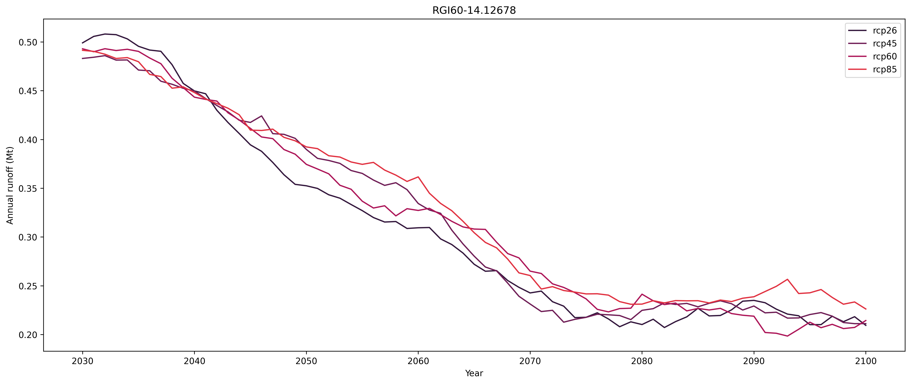
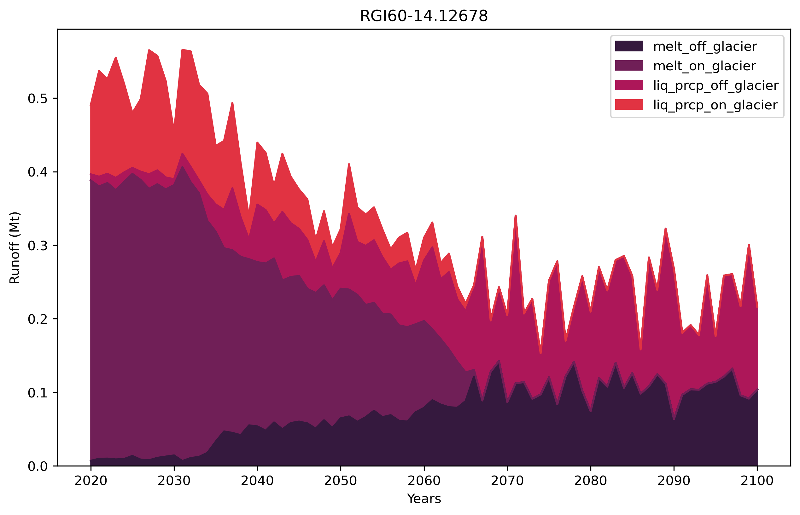
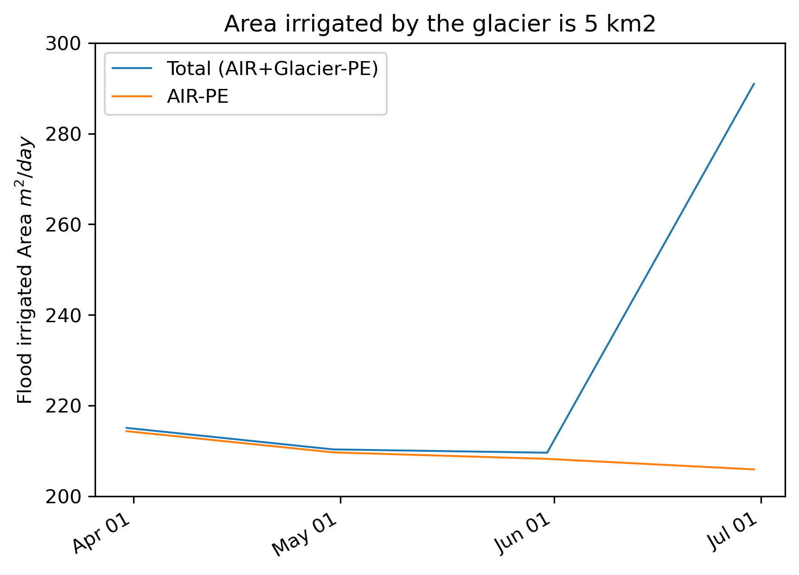

# Quantifying winter water storage using artificial ice reservoirs (AIRs)

## Notebooks
- [test_W5E5_quality.ipynb](docs/test_W5E5_quality.ipynb): 
    - extract temperature data for Leh Glacier (4572 m a.s.l.) from W5E5 and ERA5 (monthly varying lapse rates),
    - extract temperature data from Gangles AWS (4009 m a.s.l.)
    - Apply lapse correction for AWS temperature and compare

- [Leh_peak_water.ipynb](docs/Leh_peak_water.ipynb): 
    - Methodology documentation at [OGGM Hydrological mass-balance output](https://oggm.org/tutorials/stable/notebooks/hydrological_output.html)

- [Leh_runoff.ipynb](docs/Leh_runoff.ipynb): 
    - Methodology documentation at [OGGM Hydrological mass-balance output](https://oggm.org/tutorials/stable/notebooks/hydrological_output.html)

- [glacial_irr_water.ipynb](docs/glacial_irr_water.ipynb): 
    - Methodology to find out area of land AIR runoff can irrigate. Assumptions are:
     - Leh glacier has a catchment area of 5 km2.
     - AIR median water supply is 11 m3
     - Total irrigation demand = AIR supply + Glacial supply - Potential Evapotranspiration (AIR + Glacier - PE)

## How to install!
<!-- structure as in https://github.com/fmaussion/scispack and oggm/oggm -->
the newest OGGM developer version has to be installed in order that MBsandbox works:
e.g. do:

    $ conda create --name env_mb
    $ source activate env_mb
    $ git clone  https://github.com/OGGM/oggm.git
    $ cd oggm 
    $ pip install -e .
    $ cd .. 
    $ git clone https://github.com/OGGM/massbalance-sandbox
    $ cd massbalance-sandbox
    $ pip install -e .

Test the installation via pytest while being in the massbalance-sandbox folder:

    $ pytest .

(Attention, this can take a long time. As it downloads several climate datasets and example ensemble projections into the future. If you only want to use W5E5 climate data, run instead:

    $ pytest -v -m "not no_w5e5"

The MBsandbox package can be imported in python by

    >>> import MBsandbox
